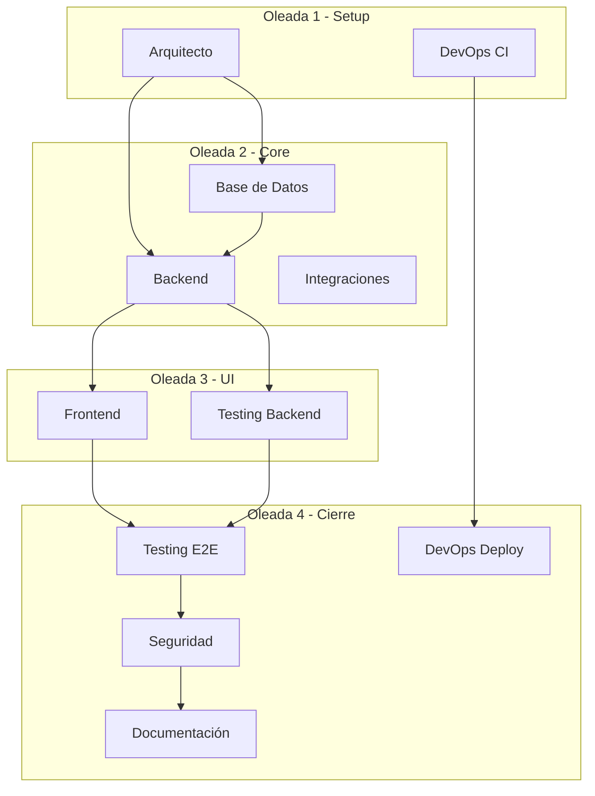

# Pipeline de Ejecución por Oleadas

## Concepto

En lugar de un pipeline secuencial agente por agente, se definen **oleadas**. Dentro de cada oleada, los teammates trabajan en paralelo. Entre oleadas hay checkpoints humanos.

## Oleada Tipo (adaptar por proyecto)



## Estructura de una Oleada

Cada oleada debe definir:
- **Teammates en paralelo**: Quiénes trabajan simultáneamente
- **Duración estimada**: Tiempo aproximado
- **Tabla de tareas**: Teammate, tarea, output, verificación
- **Checkpoint humano**: Qué revisar antes de avanzar
- **Prompt para el lead**: Instrucción exacta para lanzar la oleada

## Plantilla de Prompt por Oleada

```
Crea un equipo para la oleada [N]: [Nombre] del proyecto [Nombre].
Activa delegate mode (Shift+Tab) — tú coordinas, no implementas.

Lanza los siguientes teammates en paralelo:

1. [Rol]: "[spawn prompt específico]"
2. [Rol]: "[spawn prompt específico]"

Cuando todos terminen, presenta resumen de lo creado.
No marques como completo hasta que las verificaciones pasen.
```

## Gestión de Errores entre Oleadas

- **Teammate falla**: El lead lo detiene, revisa el error, puede relanzar un reemplazo
- **Conflicto de archivos**: El lead media y asigna propiedad temporal
- **Oleada bloqueada**: Checkpoint humano para decidir si continuar o reestructurar

## Criterios de Completitud Tipo

| Oleada | Criterio mínimo |
|--------|-----------------|
| 1 - Setup | Estructura creada, CI ejecutando, tests base pasando |
| 2 - Core | APIs funcionando, BD con migraciones, tests unitarios >80% |
| 3 - UI | UI conectada a APIs, tests E2E de flujos principales |
| 4 - Cierre | Audit seguridad limpio, docs completas, deploy funcional |

## Dependencias Típicas

| Teammate | Bloqueado por | Bloquea a |
|----------|---------------|-----------|
| Backend | Arquitecto | Frontend, Testing |
| Frontend | Backend (o contratos API) | Testing E2E |
| Base de Datos | Arquitecto | Backend |
| Testing | Backend/Frontend | Seguridad |
| DevOps Deploy | Testing E2E | — |
| Documentación | Código completo | — |
| Seguridad | Código completo | Documentación |
