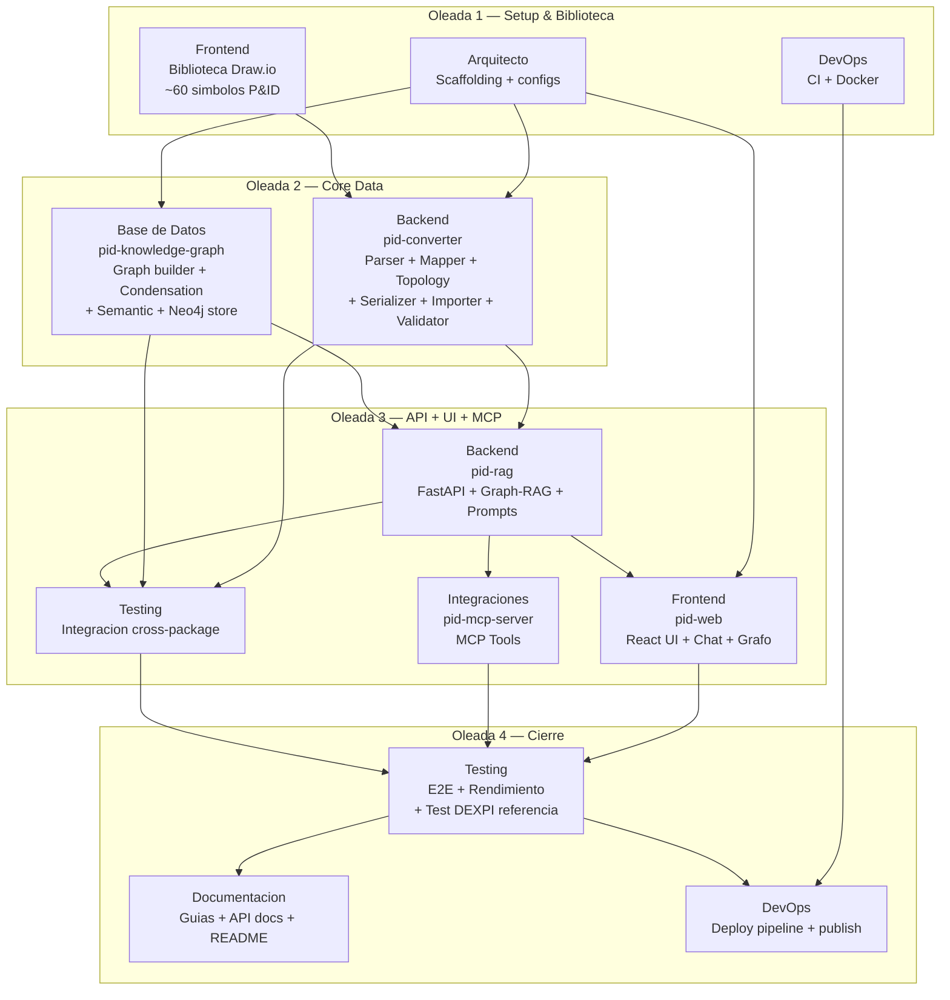

# Pipeline por Oleadas: P&ID Inteligente

## Vision General



## Oleada 1 — Setup & Biblioteca

### Teammates en paralelo
- **Arquitecto**: Scaffolding del monorepo + configuraciones + ADRs
- **DevOps**: CI/CD + Docker + docker-compose
- **Frontend**: Biblioteca de ~60 simbolos P&ID para Draw.io

### Duracion estimada
2-3 semanas. Los tres trabajan en paralelo sin dependencias entre si.

### Tabla de tareas

| Teammate | Tarea | Output | Verificacion |
|----------|-------|--------|-------------|
| Arquitecto | Crear estructura completa de carpetas | `packages/` con 6 packages inicializados | `tree -L 4 packages/` |
| Arquitecto | Inicializar pyproject.toml (Python) y package.json (TS) | Configs con dependencias base | `cat` de cada config |
| Arquitecto | Crear configs de linting raiz | `ruff.toml`, `.eslintrc.js`, `.prettierrc` | Archivos validos |
| Arquitecto | Documentar ADRs 001-006 | `docs/adr/adr-001.md` a `adr-006.md` | ADRs completos |
| DevOps | Crear Dockerfiles multi-stage | `docker/Dockerfile.api`, `.web`, `.mcp` | `docker build` sin errores |
| DevOps | Crear docker-compose.yml + dev override | Stack completo: api, web, mcp, neo4j | `docker-compose config` valido |
| DevOps | Crear CI workflows | `ci-python.yml`, `ci-typescript.yml`, `e2e.yml` | `actionlint` pasa |
| Frontend | Crear ~60 simbolos P&ID con metadatos DEXPI | `packages/drawio-library/shapes/` | Simbolos se cargan en Draw.io |
| Frontend | Definir estilos de linea (proceso, senal) | Estilos con atributos DEXPI | Lineas con metadatos correctos |
| Frontend | Crear plantilla .drawio con capas | `packages/drawio-library/templates/` | 3 capas funcionales en Draw.io |
| Frontend | Empaquetar como pid-library.xml | `packages/drawio-library/pid-library.xml` | Cargable via clibs URL |
| Frontend | Crear P&ID de ejemplo | Tanque->Bomba->Valvula->Intercambiador+TIC | P&ID completo con todos los metadatos |

### Checkpoint humano
**Que revisar:**
- [ ] Estructura de carpetas coincide con `specs/04_arquitectura.md`
- [ ] Los ~60 simbolos tienen metadatos DEXPI correctos (dexpi_class, component_class, atributos de ingenieria)
- [ ] Los simbolos se ven correctamente en Draw.io (escalado, proporciones, etiquetas)
- [ ] La plantilla .drawio tiene las 3 capas (Process, Instrumentation, Annotations)
- [ ] El P&ID de ejemplo es correcto desde el punto de vista de ingenieria de procesos
- [ ] `docker-compose up` levanta los 4 servicios (aunque api/web/mcp esten vacios)
- [ ] CI ejecuta lint para ambos lenguajes

**Criterio de avance:** El ingeniero de procesos confirma que puede dibujar un P&ID completo en Draw.io con la biblioteca y todos los metadatos DEXPI, sin editar XML a mano.

### Prompt para el Lead

```
Crea un equipo para la Oleada 1: Setup & Biblioteca del proyecto P&ID Inteligente.
Activa delegate mode (Shift+Tab) — tu coordinas, no implementas.

Lanza los siguientes teammates en paralelo:

1. Arquitecto: "Eres el teammate de Arquitectura en el proyecto P&ID Inteligente.
   Tu scope exclusivo: docs/adr/, ruff.toml, .eslintrc.js, .prettierrc, y scaffolding
   inicial de packages/. [spawn prompt completo de specs/05_equipo.md]"

2. DevOps: "Eres el teammate de DevOps en el proyecto P&ID Inteligente.
   Tu scope exclusivo: .github/workflows/, docker/, docker-compose.yml.
   [spawn prompt completo de specs/05_equipo.md — solo tareas de Oleada 1]"

3. Frontend: "Eres el teammate de Frontend en el proyecto P&ID Inteligente.
   Tu scope exclusivo: packages/drawio-library/.
   [spawn prompt completo de specs/05_equipo.md — solo tareas de Oleada 1]"

Cuando todos terminen, presenta resumen de lo creado.
No marques como completo hasta que las verificaciones pasen.
```

---

## Oleada 2 — Core Data

### Dependencias
- **Requiere**: Oleada 1 completada (scaffolding, configs, biblioteca Draw.io)
- **Frontend (drawio-library)** debe estar listo para que Backend pueda parsear .drawio con los simbolos

### Teammates en paralelo
- **Backend**: pid-converter completo (parser, mapper, topology, serializer, importer, validator, CLI)
- **Base de Datos**: pid-knowledge-graph completo (graph_builder, condensation, semantic, neo4j_store, migrations)

### Duracion estimada
4-5 semanas. Backend y Base de Datos trabajan en paralelo. Backend es la ruta critica (topologia nozzle-a-nozzle es lo mas complejo del proyecto).

### Tabla de tareas

| Teammate | Tarea | Output | Verificacion |
|----------|-------|--------|-------------|
| Backend | Implementar parser/ mxGraph XML | Modelo interno del P&ID | Test: parsea P&ID de ejemplo |
| Backend | Implementar mapper/ a pyDEXPI | Clases Pydantic instanciadas | Test: mapeo correcto de atributos |
| Backend | Implementar topology/ nozzle-a-nozzle | PipingNetworkSegments conectados | Test: topologia lineal + ramificacion |
| Backend | Implementar serializer/ Proteus XML | Archivo .xml DEXPI valido | Test contra schema XSD |
| Backend | Implementar importer/ DEXPI -> Draw.io | Archivo .drawio generado | Test: ida y vuelta produce equivalente |
| Backend | Implementar validator/ | Reporte de errores | Test: detecta tags faltantes, conexiones rotas |
| Backend | Implementar CLI con Typer | `pid-converter convert/import/validate` | CLI funcional |
| Backend | Tests unitarios | >80% cobertura | `pytest --coverage` |
| Base de Datos | Implementar graph_builder.py | NetworkX graph desde pyDEXPI | Test: nodos y relaciones correctos |
| Base de Datos | Implementar condensation.py | Grafo de alto nivel | Test: equipos como nodos, flujos como edges |
| Base de Datos | Implementar semantic.py | Labels descriptivos | Test: "Pump P-101 (centrifugal, 15 kW)" |
| Base de Datos | Implementar neo4j_store.py | CRUD + queries Cypher | Test: carga, vecinos, camino, lazo |
| Base de Datos | Crear migrations/ + init.cypher | Schema Neo4j | Migrations up/down sin errores |
| Base de Datos | Tests unitarios | >80% cobertura | `pytest --coverage` |

### Checkpoint humano
**Que revisar:**
- [ ] Conversion Draw.io -> DEXPI Proteus XML produce XML valido (validar contra XSD DEXPI)
- [ ] Importacion DEXPI -> Draw.io produce .drawio con shapes y conexiones correctas
- [ ] Ida y vuelta (Draw.io -> DEXPI -> Draw.io) produce resultado equivalente al original
- [ ] Topologia nozzle-a-nozzle correcta (verificar con P&ID de ejemplo)
- [ ] Validador detecta errores reales (probar con P&ID intencionalmente incompleto)
- [ ] Knowledge Graph en Neo4j tiene nodos y relaciones correctas (explorar en Neo4j Browser)
- [ ] Grafo condensado simplifica correctamente (verificar que no pierde informacion critica)
- [ ] Etiquetas semanticas son utiles para un LLM (legibles, con unidades, completas)
- [ ] Test con P&ID de referencia DEXPI (C01V04-VER.EX01.xml) pasa o tiene errores menores documentados

**Criterio de avance:** El ingeniero de procesos confirma que el conversor y el Knowledge Graph representan correctamente un P&ID real. La topologia nozzle-a-nozzle es correcta al menos para topologias lineales y con ramificacion simple.

### Prompt para el Lead

```
Crea un equipo para la Oleada 2: Core Data del proyecto P&ID Inteligente.
Activa delegate mode (Shift+Tab) — tu coordinas, no implementas.

Prerequisitos verificados: Oleada 1 completada. Scaffolding listo, biblioteca Draw.io
con ~60 simbolos, Docker y CI funcionando.

Lanza los siguientes teammates en paralelo:

1. Backend: "Eres el teammate de Backend en el proyecto P&ID Inteligente.
   Tu scope exclusivo: packages/pid-converter/.
   [spawn prompt completo de specs/05_equipo.md — solo tareas de Oleada 2]"

2. Base de Datos: "Eres el teammate de Base de Datos en el proyecto P&ID Inteligente.
   Tu scope exclusivo: packages/pid-knowledge-graph/ y docker/neo4j/.
   [spawn prompt completo de specs/05_equipo.md]"

Nota: Backend es la ruta critica. Si se bloquea en topology/ (nozzle-a-nozzle),
permitir que avance con el resto y deje topology/ con soporte basico (lineal).
Base de Datos puede usar el output de Backend (pyDEXPI objects) para construir
el grafo aunque el conversor no este 100% completo.

Cuando todos terminen, presenta resumen de lo creado.
No marques como completo hasta que las verificaciones pasen.
```

---

## Oleada 3 — API + UI + MCP

### Dependencias
- **Requiere**: Oleada 2 completada (pid-converter funcional, pid-knowledge-graph funcional)
- Backend necesita pid-converter y pid-knowledge-graph para exponer via API
- Frontend necesita los endpoints de API definidos
- Integraciones necesita los endpoints de API definidos
- Testing necesita todos los packages para tests de integracion

### Teammates en paralelo
- **Backend**: pid-rag (FastAPI + Graph-RAG + system prompts)
- **Frontend**: pid-web (React UI con chat, grafo interactivo, visor P&ID)
- **Integraciones**: pid-mcp-server (MCP Tools TypeScript)
- **Testing**: Tests de integracion cross-package

### Duracion estimada
3-4 semanas. Cuatro teammates en paralelo. Backend debe definir los contratos de API (OpenAPI) al inicio para desbloquear a Frontend e Integraciones.

### Estrategia de desbloqueo
Backend genera el schema OpenAPI en las primeras horas/dia. Frontend e Integraciones usan ese contrato para implementar en paralelo. Si hay cambios en la API, Backend notifica via el Lead.

### Tabla de tareas

| Teammate | Tarea | Output | Verificacion |
|----------|-------|--------|-------------|
| Backend | FastAPI app con CORS y OpenAPI | `api/app.py` + schema OpenAPI | `uvicorn` arranca, `/docs` muestra schema |
| Backend | Routes: convert, graph, chat, validate | 4 routers funcionales | Tests de cada endpoint |
| Backend | Graph-RAG retrieval | Seleccion de subgrafo por tipo de pregunta | Test: pregunta de flujo vs pregunta de equipo |
| Backend | System prompt de ingenieria | Prompt ISA 5.1 + errores comunes | Test: LLM responde correctamente a consultas tipo |
| Backend | SSE streaming para chat | Endpoint /api/chat con streaming | Test: respuesta llega en chunks |
| Frontend | Configurar React + Vite + Tailwind + Zustand | Proyecto base funcional | `npm run build` sin errores |
| Frontend | Componente chat/ con streaming SSE | Chat funcional | Respuestas llegan en tiempo real |
| Frontend | Componente graph/ interactivo | Grafo con nodos clickeables | Cytoscape.js/React Flow renderiza correctamente |
| Frontend | Componente pid/ visor | Referencia visual del P&ID | Muestra informacion del P&ID activo |
| Frontend | Stores Zustand + Services TanStack Query | Estado y API client | Tests de stores y services |
| Integraciones | MCP Server con SDK oficial | Server arranca y registra tools | `npm run build` sin errores |
| Integraciones | Tools: convert, import, query, validate, build-graph | 5 tools funcionales | Cada tool llama al endpoint correcto |
| Integraciones | Integracion con drawio-mcp-server (Gazo) | Operaciones Draw.io via MCP | Test: crear shape via MCP |
| Testing | Test integracion: pipeline completo | .drawio -> DEXPI -> KG -> LLM | Pipeline funciona sin errores |
| Testing | Test integracion: ida y vuelta converter | .drawio -> DEXPI -> .drawio equivalente | Archivos equivalentes |
| Testing | Test integracion: Graph-RAG retrieval | Pregunta -> subgrafo correcto -> respuesta | Retrieval selecciona nodos relevantes |

### Checkpoint humano
**Que revisar:**
- [ ] Web UI funcional: se puede subir un .drawio y hacer preguntas
- [ ] Chat con streaming: respuestas llegan en tiempo real, no se cortan
- [ ] Grafo interactivo: los nodos corresponden al P&ID real, son clickeables
- [ ] LLM responde correctamente a preguntas tipo (probar las 4 de specs/02_producto.md)
- [ ] MCP Server registra todos los tools y responde a llamadas
- [ ] Pipeline completo funciona: .drawio -> DEXPI -> KG -> consulta LLM
- [ ] Tests de integracion pasan

**Criterio de avance:** El ingeniero de procesos puede subir un P&ID a la web UI, hacer preguntas en lenguaje natural y obtener respuestas correctas y utiles basadas en el Knowledge Graph. El MCP Server orquesta todo el pipeline.

### Prompt para el Lead

```
Crea un equipo para la Oleada 3: API + UI + MCP del proyecto P&ID Inteligente.
Activa delegate mode (Shift+Tab) — tu coordinas, no implementas.

Prerequisitos verificados: Oleada 2 completada. pid-converter y pid-knowledge-graph
funcionales con tests pasando.

IMPORTANTE — Estrategia de desbloqueo:
Backend debe generar el schema OpenAPI (contratos de API) lo antes posible.
Una vez disponible, compartirlo con Frontend e Integraciones para que
implementen en paralelo. Si Backend modifica un endpoint, notificame
inmediatamente para que coordine con los afectados.

Lanza los siguientes teammates en paralelo:

1. Backend: "Eres el teammate de Backend en el proyecto P&ID Inteligente.
   Tu scope exclusivo: packages/pid-rag/.
   PRIORIDAD: genera el schema OpenAPI primero y notifica al Lead.
   [spawn prompt completo de specs/05_equipo.md — solo tareas de Oleada 3]"

2. Frontend: "Eres el teammate de Frontend en el proyecto P&ID Inteligente.
   Tu scope exclusivo: packages/pid-web/.
   Usa el schema OpenAPI de Backend para implementar los API clients.
   [spawn prompt completo de specs/05_equipo.md — solo tareas de Oleada 3]"

3. Integraciones: "Eres el teammate de Integraciones en el proyecto P&ID Inteligente.
   Tu scope exclusivo: packages/pid-mcp-server/.
   Usa el schema OpenAPI de Backend para implementar los MCP tools.
   [spawn prompt completo de specs/05_equipo.md]"

4. Testing: "Eres el teammate de Testing en el proyecto P&ID Inteligente.
   Tu scope exclusivo: e2e/ y tests de integracion cross-package.
   Espera a que Backend tenga la API funcional antes de ejecutar tests de integracion.
   [spawn prompt completo de specs/05_equipo.md — solo tests de integracion]"

Cuando todos terminen, presenta resumen de lo creado.
No marques como completo hasta que las verificaciones pasen.
```

---

## Oleada 4 — Cierre

### Dependencias
- **Requiere**: Oleada 3 completada (API funcional, web UI funcional, MCP operativo, tests de integracion pasando)

### Teammates en paralelo
- **Testing**: Tests E2E con Playwright + test de referencia DEXPI + rendimiento
- **Documentacion**: Guias, API docs, README
- **DevOps**: Pipeline de deploy + publicacion PyPI/Docker Hub

### Duracion estimada
2-3 semanas. Los tres trabajan en paralelo. Testing puede empezar inmediatamente; Documentacion y DevOps necesitan que el stack este estable.

### Tabla de tareas

| Teammate | Tarea | Output | Verificacion |
|----------|-------|--------|-------------|
| Testing | Tests E2E con Playwright (5 flujos) | `e2e/*.spec.ts` | `npx playwright test` pasa |
| Testing | Test de referencia DEXPI | Comparacion C01V04-VER.EX01.xml | Estructura equivalente |
| Testing | Tests de rendimiento | KG <5s, LLM <15s | Umbrales cumplidos |
| Testing | Reporte de cobertura global | >80% | `pytest --coverage` + `vitest --coverage` |
| Documentacion | Getting started | `docs/guides/getting-started.md` | Usuario nuevo puede seguir los pasos |
| Documentacion | Guia de biblioteca Draw.io | `docs/guides/drawio-library.md` | Instrucciones claras con screenshots |
| Documentacion | Guia de conversor | `docs/guides/converter.md` | Comandos CLI correctos |
| Documentacion | Guia de Knowledge Graph | `docs/guides/knowledge-graph.md` | Queries de ejemplo funcionan |
| Documentacion | Guia de web UI | `docs/guides/web-ui.md` | Flujos documentados |
| Documentacion | Guia de MCP Server | `docs/guides/mcp-server.md` | Configuracion reproducible |
| Documentacion | API docs | `docs/api/` | Generado desde OpenAPI |
| Documentacion | README.md raiz | `README.md` | Quick start funcional |
| DevOps | Pipeline de publish a PyPI | `.github/workflows/publish.yml` | Workflow valido |
| DevOps | Pipeline de publish Docker images | Parte de `publish.yml` | Build + push funcional |
| DevOps | Optimizar Dockerfiles | Multi-stage optimizados | Imagenes < 500MB |
| DevOps | Validar docker-compose.yml completo | Stack levanta limpio de cero | `docker-compose up` sin errores |

### Checkpoint humano (final)
**Que revisar:**
- [ ] `docker-compose up` levanta todo de cero y funciona
- [ ] Tests E2E pasan (los 5 flujos principales)
- [ ] Test de referencia DEXPI pasa o tiene desviaciones menores documentadas
- [ ] Rendimiento dentro de umbrales (KG <5s, LLM <15s)
- [ ] Cobertura >80%
- [ ] Documentacion: un usuario nuevo puede ir de cero a consultar un P&ID siguiendo getting-started
- [ ] README.md tiene quick start claro
- [ ] CI/CD pipeline funciona: push a main ejecuta lint+test+build
- [ ] El ingeniero de procesos ha probado el flujo completo con un P&ID real y esta satisfecho

**Criterio de avance:** MVP completo. El stack funciona end-to-end, esta documentado, testeado y listo para publicar.

### Prompt para el Lead

```
Crea un equipo para la Oleada 4: Cierre del proyecto P&ID Inteligente.
Activa delegate mode (Shift+Tab) — tu coordinas, no implementas.

Prerequisitos verificados: Oleada 3 completada. API funcional, web UI funcional,
MCP operativo, tests de integracion pasando.

Lanza los siguientes teammates en paralelo:

1. Testing: "Eres el teammate de Testing en el proyecto P&ID Inteligente.
   Tu scope exclusivo: e2e/.
   [spawn prompt completo de specs/05_equipo.md — solo E2E, referencia DEXPI y rendimiento]"

2. Documentacion: "Eres el teammate de Documentacion en el proyecto P&ID Inteligente.
   Tu scope exclusivo: docs/ (excepto docs/adr/) y README.md raiz.
   [spawn prompt completo de specs/05_equipo.md]"

3. DevOps: "Eres el teammate de DevOps en el proyecto P&ID Inteligente.
   Tu scope exclusivo: .github/workflows/, docker/, docker-compose.*.
   [spawn prompt completo de specs/05_equipo.md — solo tareas de Oleada 4]"

Cuando todos terminen, presenta resumen de lo creado.
No marques como completo hasta que las verificaciones pasen.
Este es el checkpoint final — el MVP debe estar completo.
```

---

## Dependencias Criticas

| Teammate | Bloqueado por | Bloquea a |
|----------|---------------|-----------|
| Arquitecto | — | Backend, Base de Datos, Frontend (pid-web) |
| DevOps (O1) | — | DevOps (O4) |
| Frontend (drawio-library, O1) | — | Backend (necesita .drawio con simbolos para parsear) |
| Backend (pid-converter, O2) | Arquitecto + Frontend (O1) | Backend (pid-rag), Frontend (pid-web), Integraciones, Testing |
| Base de Datos (O2) | Arquitecto (O1) | Backend (pid-rag), Testing |
| Backend (pid-rag, O3) | Backend (O2) + Base de Datos (O2) | Frontend (pid-web), Integraciones, Testing |
| Frontend (pid-web, O3) | Backend (pid-rag, contratos API) | Testing E2E |
| Integraciones (O3) | Backend (pid-rag, contratos API) | Testing E2E |
| Testing integracion (O3) | Backend + Base de Datos + API | Testing E2E |
| Testing E2E (O4) | Oleada 3 completa | Documentacion (confirma flujos) |
| Documentacion (O4) | Stack funcional | — |
| DevOps deploy (O4) | Testing E2E | — |

## Gestion de Errores entre Oleadas

| Escenario | Accion |
|-----------|--------|
| Teammate falla en una tarea | Lead lo detiene, revisa el error. Si es un bug, relanza con instruccion de fix. Si es un bloqueo de diseno, checkpoint humano |
| Topologia nozzle-a-nozzle demasiado compleja | Permitir que Backend avance con soporte basico (topologia lineal). Marcar ramificaciones complejas como TODO para iteracion posterior |
| Conflicto de archivos compartidos | Lead media: identifica quien debe hacer el cambio segun ownership, y el otro consume |
| Neo4j no arranca en Docker | DevOps resuelve. Base de Datos puede trabajar con Neo4j local mientras tanto |
| API cambia contratos durante Oleada 3 | Backend notifica al Lead inmediatamente. Lead pausa Frontend/Integraciones, comunica el cambio, reanudan con contrato actualizado |
| Test de referencia DEXPI no pasa | Documentar desviaciones. Si son menores (atributos opcionales), aceptar con nota. Si son estructurales, volver a Oleada 2 para fix |

## Resumen de Cronograma

| Oleada | Teammates | Duracion | Acumulado |
|--------|-----------|----------|-----------|
| 1 — Setup & Biblioteca | Arquitecto + DevOps + Frontend | 2-3 semanas | Semana 3 |
| 2 — Core Data | Backend + Base de Datos | 4-5 semanas | Semana 8 |
| 3 — API + UI + MCP | Backend + Frontend + Integraciones + Testing | 3-4 semanas | Semana 12 |
| 4 — Cierre | Testing + Documentacion + DevOps | 2-3 semanas | Semana 15 |
| **Total** | | **11-15 semanas** | **~3-4 meses** |

**Nota:** Con Agent Teams la estimacion se comprime vs el plan original (16-21 semanas) por la paralelizacion real dentro de cada oleada.

## Siguiente Paso
Avanzar a **Fase 7: Estandares y Convenciones** para definir reglas de codigo, testing, verificacion y configuraciones compartidas.
